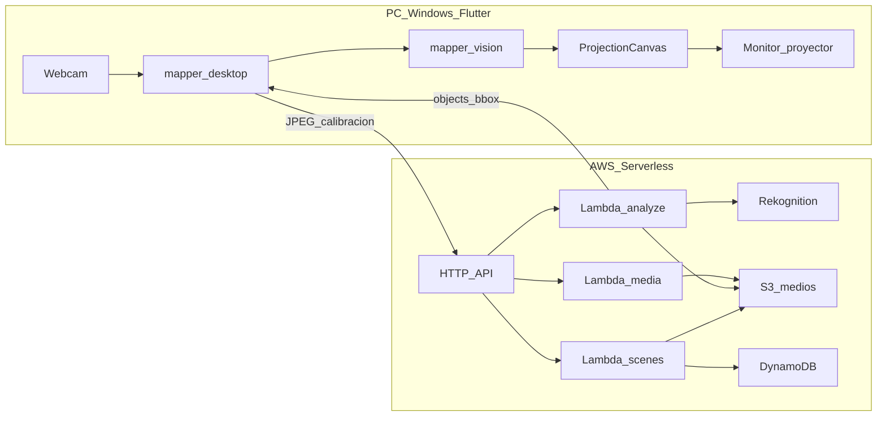

# Arquitectura del sistema

## Vista general

## Responsabilidades por capa

### Edge (Flutter)

- Captura o simulación de vista cámara.
- Editor de regiones (manual + overlay Rekognition).
- Wizard de **homografía** (4 puntos).
- Compositor: recorte de video/color por `bboxProjector`.
- Modos Setup / Ensayo / Show.
- Caché offline de escenas (`CacheService`).

### AWS

| Servicio | Rol |
|----------|-----|
| API Gateway HTTP | REST para escenas, analyze, presign |
| Lambda `analyze` | S3 + `DetectLabels` → JSON objetos |
| Lambda `scenes` | CRUD escena/objetos en DynamoDB |
| Lambda `media` | URLs firmadas para subir MP4 |
| S3 | Capturas JPEG, videos |
| DynamoDB | Metadatos escena, bindings, calibración |
| Rekognition | Bounding boxes + labels por imagen |

### Paquetes Dart

| Paquete | Rol |
|---------|-----|
| `mapper_core` | Modelos, homografía, `SceneStore` |
| `mapper_aws_api` | Cliente Dio → API Gateway |
| `mapper_vision` | `BboxTracker` entre re-detecciones |
| `mapper_desktop` | UI Windows, Riverpod, ventana fullscreen |

## Flujo principal (happy path)

1. Usuario abre escena en **Setup**.
2. Calibra cámara→proyector (4 esquinas).
3. Toma foto → `POST /scenes/{id}/capture/analyze`.
4. Rekognition devuelve cajas; usuario edita y asigna videos locales.
5. Pasa a **Ensayo** (rejilla debug) o **Show** (salida limpia).
6. Durante show: tracker local; **Espacio** re-sync; **R** re-analiza AWS.

## Coordenadas (crítico)

- Rekognition → cajas en espacio **imagen cámara** (normalizado 0..1).
- Proyector → espacio **pantalla proyección**.
- `Homography` en `mapper_core` transforma `bboxCamera` → `bboxProjector`.
- Sin calibración, el video no “cae” sobre el objeto físico.
