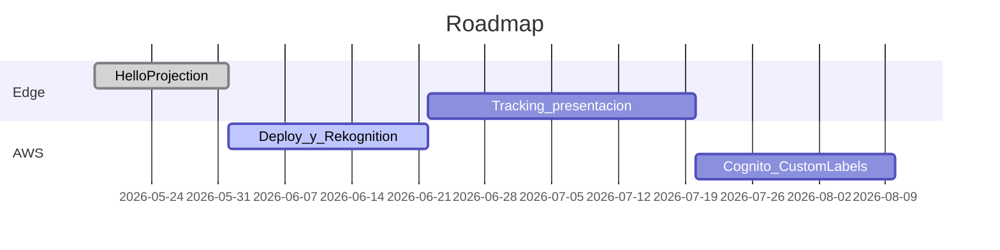

# Roadmap por fases

## Estado actual (post commit inicial)

| ID | Tarea | Estado |
|----|-------|--------|
| scaffold-flutter | Monorepo + paquetes | Hecho |
| mvp-local | Regiones + video + fullscreen | Hecho (base) |
| infra-cdk | Código CDK en repo | Hecho — **deploy pendiente** |
| calibration | Wizard homografía | Hecho |
| hybrid-tracking | Tracker básico + hooks re-sync | Hecho (mejorable) |
| presentation-mode | Setup / Ensayo / Show | Hecho |

## Fase 0 — Hello Projection

- Rectángulos manuales, video/color por región, fullscreen.
- **Éxito:** demo en mesa con 2–3 objetos.

## Fase 1 — AWS en producción interna

- `cdk deploy`, `api_config.json` con ApiUrl real.
- Analyze con **foto real** de escena.
- Subida S3 de videos, binding por objeto.
- **Éxito:** flujo nube completo excepto tracking fino.

## Fase 2 — Presentación grandiosa

- OpenCV/CSRT o similar para tracking.
- Transiciones, fade, playlist por objeto.
- Cache offline robusto en venue.
- **Éxito:** mover objeto y video sigue hasta re-analizar.

## Fase 3 — Escala

- Cognito + workspaces.
- Rekognition Custom Labels.
- Panel web admin opcional; show sigue en Windows.

## Qué aprender (priorizado)

1. Flutter Desktop + segunda pantalla.
2. Homografía / coordenadas 2D.
3. Rekognition límites y confidence.
4. AWS CDK deploy y outputs.
5. Compositing video (máscaras, rendimiento).
